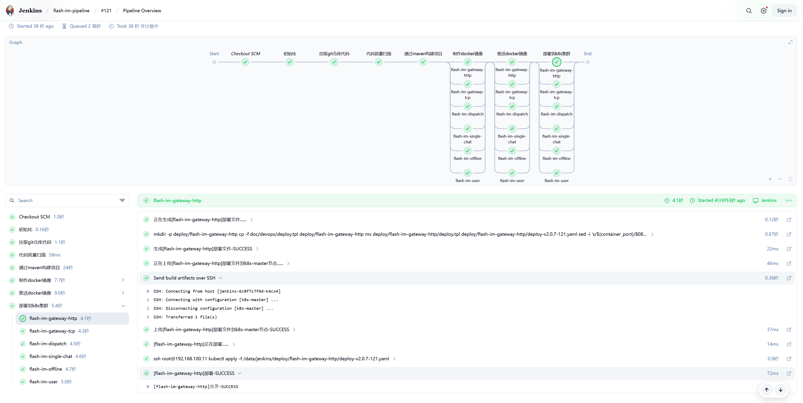
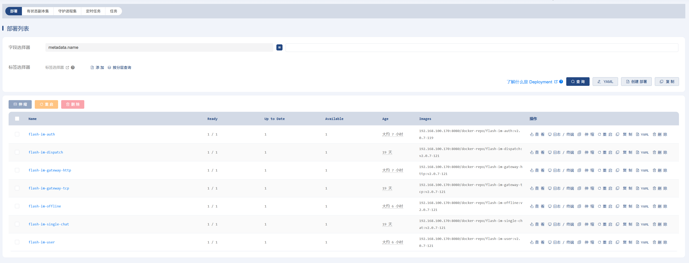
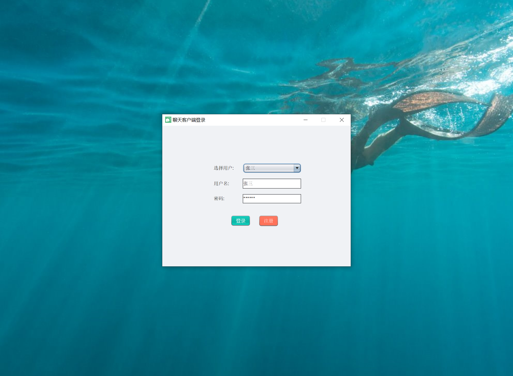
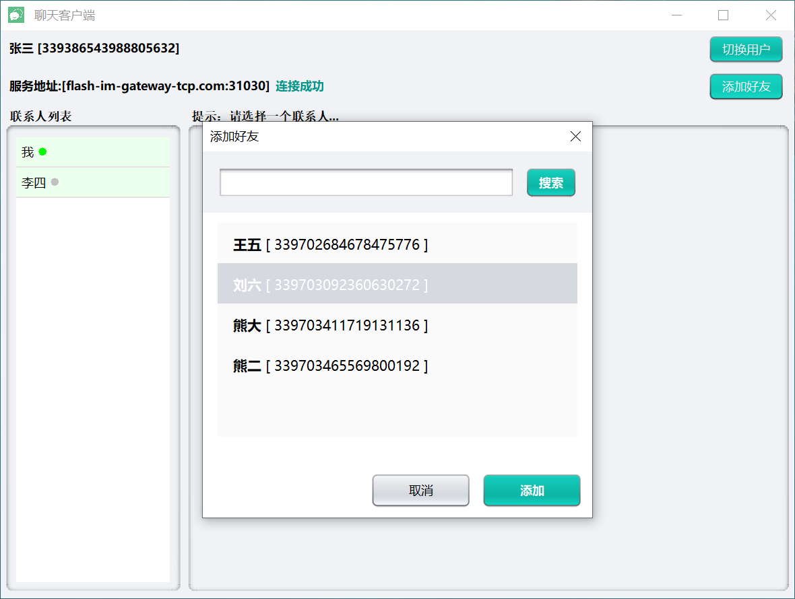
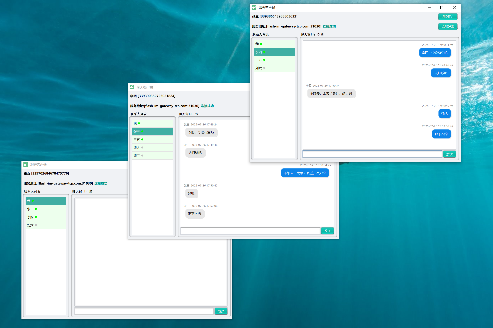
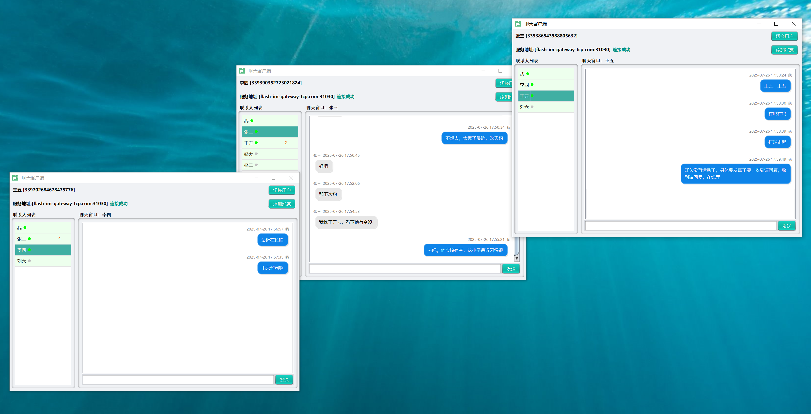
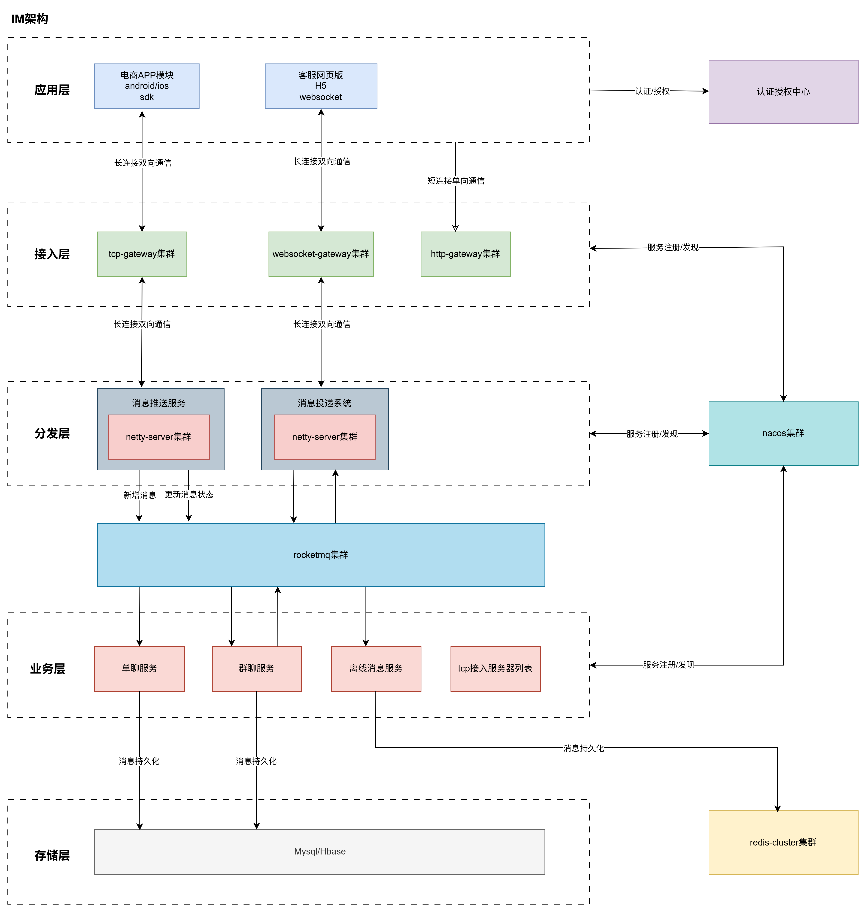

# flash-im
## 项目介绍
作为一个即时通讯系统，系统采用了分布式架构设计，引入了 Netty 框架，以实现高性能、实时的消息传递，目标流量设计可达到百万连接并发。

注：本项目只是个人学习练手，仅作分享和交流

## 项目功能
- [x] 客户端sdk
- [x] 服务端sdk
- [x] 接入示例
- [x] 单聊功能
- [X] 离线消息
- [x] 流水线部署
- [x] 在线状态
- [x] 已读消息
- [ ] 群聊功能
- [ ] 红包功能
- [ ] 表情图片视频

## 效果展示
**流水线部署**


**部署到k8s集群**  


**登录**  


**添加好友**  


**在线聊天**  


**未读消息**


## IM架构设计


## 消息流转时序


## 各个分层主要技术栈
- 应用层：
  - 桌面应用程序：java swing
- 网关层：
  - tcp网关：spring boot、netty、nacos、redis、loadbalancer、httpclient、jwt
  - http网关：spring cloud gateway、loadbalancer、nacos、jwt
- 分发层：spring boot、netty、nacos、redis、rocketmq
- 微服务层：
  - 单聊：spring boot web、nacos、rocketmq、mysql
  - 离线：spring boot web、nacos、rocketmq、mysql、redis
  - 用户：spring boot web、nacos、mysql、redis
  - 认证：spring boot web、security、nacos、mysql、redis
- 存储层：mysql、redis


## 项目模块解析
### 目录结构
```text
|-- flash-im
|   |-- flash-im-general
|   |   |           `-- src
|   |-- flash-im-netty
|   |   |           `-- flash-im-core
|   |   |           `-- flash-im-dispatch
|   |   |           `-- flash-im-example
|   |   |           `-- flash-im-gateway-tcp
|   |               `-- flash-im-gateway-websocket
|   |-- flash-im-service
|   |   |           `-- flash-im-auth
|   |   |           `-- flash-im-gateway-http
|   |   |           `-- flash-im-offline-chat
|   |   |           `-- flash-im-single-chat
|   |               `-- flash-im-user
|   |-- flash-im-starter
|       |           `-- flash-im-cache-spring-boot-starter
|       |           `-- flash-im-core-spring-boot-starter
|       |           `-- flash-im-mq-spring-boot-starter
|       |           `-- flash-im-security-spring-boot-starter
|                   `-- flash-im-nacos-spring-boot-starter
```

#### flash-im-general
- 定义：公共包
- 功能：提供工具类、常量、枚举、模型实体

#### flash-im-netty
- 定义：netty相关操作的包
- 功能：目录，起到模块分组作用
  - flash-im-core
    - 功能：提供基于netty的双向通信**核心包**
  - flash-im-dispatch
    - 功能：提供基于netty+rocketmq的消息分发和消息投递功能实现
  - flash-im-example
    - 功能：提供netty客户端接入服务端的示例，提供简单的聊天功能示例实现
  - flash-im-gateway-tcp
    - 功能：
      - netty-server：负责与用户的客户端连接、认证、心跳、消息收发，
      - netty-client：负责与dispatch连接、转发消息到dispatch、接收dispatch消息后通过nettyServer转发消息到用户
  - flash-im-gateway-websocket （暂无，待实现，同tcp差不多）
    - 功能：提供基于netty的websocket网关实现，负责与用户的客户端的websocket连接，与dispatch连接，起到网关作用
#### flash-im-service
- 定义：微服务相关
- 功能：目录，起到模块分组作用
  - flash-im-auth
    - 功能：提供基于spring security，jwt的用户认证功能，生成jwt的accessToken以及refreshToken，提供公钥查询，被有认证功能tcp和http网关所依赖，所以auth要先部署跑起来
  - flash-im-gateway-http
    - 功能：提供基于spring gateway的网关功能，负责http请求的路由和转发，所有客户端的请求都要经过此来转发
  - flash-im-single-chat
    - 功能：提供单聊功能，主要负责消费来自dispatch的mq消息、消息的持久化、查询、消息投递到分发系统dispatch
  - flash-im-offline
    - 功能：提供离线消息功能，主要负责消费来自dispatch的mq消息、离线消息的持久化和查询、批量离线消息投递到dispatch
  - flash-im-user
    - 功能：提供用户信息查询，修改、好友功能，主要负责消费来自dispatch的mq消息、好友在线状态推送到dispatch
#### flash-im-starter
- 定义：抽取微服务的公共配置组件
- 功能：目录，起到模块分组作用
  - flash-im-cache-spring-boot-starter
    - 功能：封装redis缓存相关的spring-boot自动配置
  - flash-im-core-spring-boot-starter
    - 功能：封装spring基础上下文的spring-boot自动配置
  - flash-im-mq-spring-boot-starter
    - 功能：封装消息队列的spring-boot自动配置
  - flash-im-nacos-spring-boot-starter
    - 功能：封装nacos的注册中心和配置中心的spring-boot自动配置
  - flash-im-security-spring-boot-starter
    - 功能：封装jwt生成和校验的spring-boot自动配置

### 亮点
- 双向通信：gateway网关既有netty客户端，也有netty服务端，其中服务端与用户连接，客户端与dispatch连接  
- 引入消息队列：使服务之间解耦，服务负责的功能更为单一，逻辑更为清晰，能有效提升系统的并发处理能力，减轻数据库的压力  
- 无状态服务：netty服务器可水平扩展服务节点，应对更高的流量  
- k8s部署：通过配置转发tcp协议的流量来实现客户端与服务端的tcp连接
- 具备完整的示例：通过示例实现各个基本的业务功能，以验证基础架构健壮性。
- 知识覆盖面广且实用：从前端到后端提供完整的调用链路，供学习、笔记、借鉴都不错。

### 不足
- 部分硬编码写死：待做成可配置 
- 模块划分上还不够细：存在引用依赖冗余 
- 桌面程序开发经验不足：示例中的demo界面还不够精致美观 
- 有时候急着实现和调试，很多地方的代码注释还不够，但关键的注释还是有的，需要交流请联系

### netty通信设计
- 核心消息类：ImMessage，支持类型request（请求）、response（响应）、notify（通知）、heartbeat（心跳）
- 核心消息处理类：MessageProcessManager,封装不同消息类型的通用处理逻辑，提供核心的消息发送和消息处理实现
- Netty的编解码：ImMessageDecoder、ImMessageEncoder，使用长度域解析器LengthFieldBasedFrameDecoder
- 数据序列化：跨语言的性能佼佼者 google protobuf
- 回调设计：通过消息id作为桥梁，发送后缓存该消息的异步响应，收到响应时通过消息id找到异步响应，并设置响应结果以及通知异步响应执行成功或失败的回调
- 流控设计：通过Semaphore控制，避免瞬时流量过大，资源挤压，压垮服务

### 如何保证消息的可靠性（消息零丢失）
解决方案：
  - 客户端：
    - 消息确认，客户端需要对发送结果进行ack确认处理，比如通知用户发送失败或程序后台尝试失败重试
    - 每次上线向服务端发起通知，请求加载离线消息，若本地发现序列好异常，可触发按序列号拉取丢失消息。
    - 客户端打开会话窗口时，更新本地未读消息状态为已读，并将这些消息发送已读回执到服务端
    - 客户端需要支持同一消息幂等处理，避免服务端网络异常等重发导致消息重复
  - 服务端：
    - 持久化消息，设计消息状态，
    - 转发系统即时处理转发失败的消息，直接进行重试n次
    - 发送失败或重发失败，保存为离线消息

### 如何保证消息的顺序性
- 顺序问题：在分布式系统中，消息可能乱序到达。我们需要在客户端和服务器端都采取一些措施来保证消息的顺序。
- 解决方案：不管是在发送方还是接收方，客户端的会话中所有消息按(sequenceId,clientSeq)排序。  
好处：保证了客户端发送的消息顺序不会变，客户端接收的消息也是有序的。  
前提：由于网络波动等原因，客户端后发送的消息时很有可能先得到服务端的sequenceId的，所以为了防止这个问题的发生，  
客户端需要保证在发送下一条消息时，确定上一条消息已经通过ack确认得到sequenceId了，否则不予以发送，在界面就是转圈圈等待或该条消息显示发送中。
如果在指定时间内迟迟都得不到确认，则认为失败，显示发送失败，发送失败的消息可双击重发。


- 具体实现：
  - 客户端
    - 首次打开聊天会话时
      1. 从sqlite中加载历史消息20条，从sql中加载该会话最大的maxClientSeq并缓存下来
    - 发送消息
      1. 根据输入，生成消息，sequenceId=-1，status=发送中，clientSeq = maxClientSeq + 1
      2. 将消息保存到本地sqlite
      3. 通过Netty发送消息到服务器
      4. 更新ui显示消息以及消息发送状态为发送中
      5. 发送失败的消息可配置后台自动重发或手动双击消息重发
    - 接收消息
      1. 如果收到ack确认消息，更新本地数据库，status=已送达/发送失败，sequenceId=newSequenceId,更新ui显示已发送/发送失败
      2. 更新本地数据库该消息的sequenceId 和 status
      3. 对当前加载的消息列表重排序
      4. 如果收到来自好友的消息，保存到sqlite，加入消息列表，对消息列表按（sequenceId，clientSeq）排序并展示
  - 服务端
    - 分发系统
      1. 为messageId和sequenceId生成全局递增id（snowflake）
      2. 推送完整的消息到mq
      3. 收到单聊微服务的mq消息
      4. 转发消息到消息的接收者
    - 单聊微服务
      1. 收到完整的消息
      2. 保存消息到数据库
      3. 推送消息到rocketmq（携带了sequenceId和clientSeq）


### 如何保证消息的安全性
解决方案：
  - 为防止消息传输过程中不被截获、篡改、伪造，采用TLS传输层加密协议，netty提供了很好的支持,
  - 每次连接都需要在网关进行token校验

### 收获与成长
- 加深对netty框架的原理理解和使用，提升对基础通信框架和组件的开发能力
- 加深对分布式系统的理解和落地实现，提升自身的项目架构设计能力
- 加深对云原生、kubernetes、docker、jenkins的操作熟练度
- 加深对spring cloud框架使用和理解，对抽取公共starter的开发和应用
- 加深对nacos，rocket mq、redis中间件的原理理解和操作熟练度
- 加深对juc包，线程池的异步编程使用和理解
- 加深对桌面应用程序的开发熟练程度
- 加深对于BS架构的理解，能够站在不同角度分析和处理问题，特别的是网络波动或异常这一块的处理
- 有想法是一回事，真正落地实现和调试问题的过程才最为紧要，最后带来的是满满的成就


### 参考借鉴
- 参考了Java项目实战《IM即时通信系统》的架构设计
- 参考了rocketmq5.2.0版本的底层netty通讯实现
- 参考了GitHub项目JiChat的im是设计思想和实现
- 参考了GitHub项目fastim的设计思想和实现
- 本项目的示例demo很大一部分是通过AI一步一步修正来实现的，所以得特别感谢AI，哈哈。

最后，希望你能有所收获。

### 交流
个人邮箱：973667683@qq.com